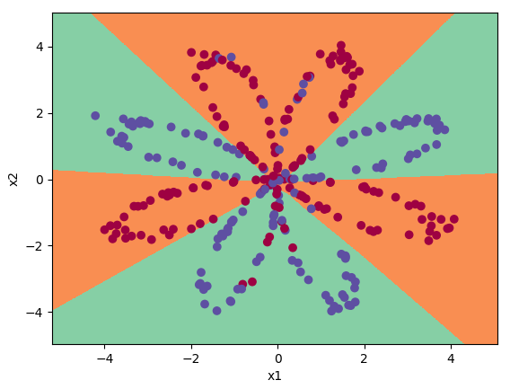

# Deep Neural Network implementation

Deep Neural Network implementation exercise. Trains parameters for classification tasks.

+ forward step (vectorized layer operations)
+ backward step (gradient descent)
+ optimization: momentum + ADAM
+ regularization: λ and dropout (units deactivation)

## Example

petal data:


summary & evaluation output:

```
HYPERPARAMETERS
---------------
convergence:
    epochs: 15000
    learning_rate: 0.0075
    β: None
    ADAM:
        β1: 0.9
        β2: 0.999
regularization:
    λ: 1
    keep_units: None

RESULTS
-------
Convergence epochs: 1969
Final cost: 0.34
TRAIN  Accuracy: 0.891
TEST Accuracy: 0.812
Baseline: ?
Bias: baseline to 0.109
Variance: 0.0781
```




## Usage

install dependencies:

`pip install numpy scikit-learn matplotlib scipy h5py`

run `run.py`

## TODO

- [ ] call data normalization
- [ ] improve ADAM optimization: 1) with deactivating units regularization 2) without any regularization
- [ ] improve momentum optimization
- [ ] shift array dimensions to X(samples·input) W(input·output) b(1·output) ...to align with train_test_split
- [ ] mini-batch size

## Errors

- [ ] activations.py:15: RuntimeWarning: overflow encountered in exp `return np.reciprocal(1 + np.exp(-Z)), sigmoid_backward`
- [ ] compute_cost method: `divide by zero encountered in log` when convergence break is disabled in train method
- [ ] ValueError: matmul: Input operand 1 has a mismatch in its core dimension 0, with gufunc signature (n?,k),(k,m?)->(n?,m?) (size 2 is different from 12288)
